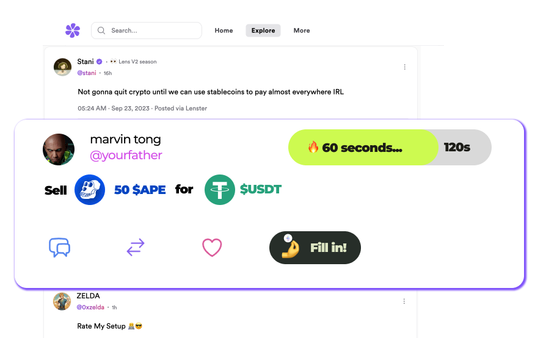
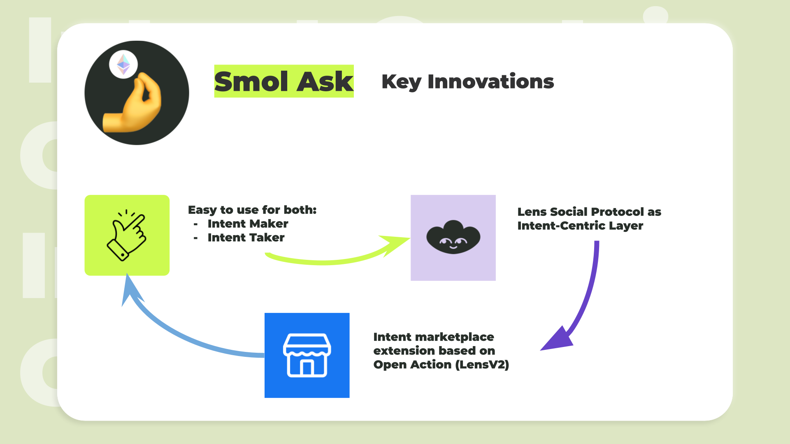

# SmolAsk - ETHGlobal NYC 2023 Submission

Smol Ask create a practical, [intent-centric](](https://www.paradigm.xyz/2023/06/intents)) experience based on the [Lens Protocol](https://lens.xyz).
- Users can express their needs with pre-set actions on Lens V2.
- These intents are visible to friends and the community, who can help promote them.
- Anyone can easily fill in the order.
- And off-chain intent pool ranks these orders and finds the best solution based on condition checks.

## How is it made?

We use a combination of on-chain smrat contract and offchain components to build the intent system. More specifically:

- A customized Lens Protocol v2 Open Action module to allow the user to create an intent (the wish to swap some token), and attach it to a Lens post
- A frontend plugin to Lenster (a popular Lens Web UI) to allow users to create the swap intent, and see the available intents in the post feed, and interact with the intent with Lens Open Action
- Use of Phat Contract (a decentralized confidential preserving compute protocol) to host the intent pool and run the auction to determine the best offer from the fillers, and submit the filling to the user

The lifecycle of the intent is described as below:

1. A user (seller) create a Lens post with the swap intent attached
2. The user's fund get locked into the intent manager contract
3. The buyers see the post and the attached the intent, and they can interact with the post to create a filling offer. At this stage, the filling offer is just a signed message (MetaTx)
4. One ore more signed offer get submitted to the intent pool. An auction run to determine the best offer for the intent owner.
5. Once the intent reaches the deadline set by the seller, the auction ends. The intent pool then submits the winning offer as an Lens Open Action to the blockchain to settle.
6. The action module facilite the transfer of the buy's and seller's token. Then a swap is finished.

In additional, since the resolving of the intent happens on the off-chain world, we allow the swap happens on the blockchains beyond Polygon (where Lens v2 is deployed).

Used technologies:

- Intent Pool & offchain auction
- [Lens Protocol](https://lens.xyz) v2 & Open Action to enable intent resolving with social awareness
- [Phala Network](https://phala.network) for building the privacy preserving offchain auction with cross-chain capability
- Meta transaction, EIP712
- Tech stack: Foundry, Solidity, Javascript / Typescript, Infura & Alchemy for RPC
- Used chains: Polygon Mumbai, Polygon zkEVM, Linea, Scroll

Hacky:

- Lens v2 was just published a week ago. It only has partial UI support. We need to apply a lot of walkaround.
- Ideally it's possible to integrate Uniswap v4 with the Open Action, but it requires some non-trivial modification to Account Abstraction frameowork. Therefore we can only leave it as a future work.

## Intent Manager Deployment

Polygon Mumbai

- Manager: [0x821284a90c1856de0d09d2bda32bb9cf28bed907](https://mumbai.polygonscan.com/address/0x821284a90c1856de0d09d2bda32bb9cf28bed907)
- Token0: [0xbf3b1a21c86a7df8fbce3e69bb85038ab6727215](https://mumbai.polygonscan.com/token/0xbf3b1a21c86a7df8fbce3e69bb85038ab6727215)
- Token1: [0xb6954802fb282fbfdc0e62fb29c670410a1ac371](https://mumbai.polygonscan.com/token/0xb6954802fb282fbfdc0e62fb29c670410a1ac371)

Polygon zkEVM

- Manager: [0x4c452058f45b64d24e7c7df7581b19a44e515536](https://testnet-zkevm.polygonscan.com/address/0x4c452058f45b64d24e7c7df7581b19a44e515536)
- Token0: [0xc79b4efbdefd494627e912641ea648dae36ec62e](https://testnet-zkevm.polygonscan.com/token/0xc79b4efbdefd494627e912641ea648dae36ec62e)
- Token1: [0xb90befa10cbe1a0c91ddd322439c85ad73d17680](https://testnet-zkevm.polygonscan.com/token/0xb90befa10cbe1a0c91ddd322439c85ad73d17680)

Linea Goerli

- Manager: [0x63d9d90009e567f6f460836813858044c6b1092f](https://goerli.lineascan.build/address/0x63d9d90009e567f6f460836813858044c6b1092f#code)
- Token0: [0x6443dc5ce52bc0ed921a22df317e195af9900487](https://goerli.lineascan.build/token/0x6443dc5ce52bc0ed921a22df317e195af9900487)
- Token1: [0x0a2de41acfeab02f841981a081ab68d1f0f1f1d8](https://goerli.lineascan.build/token/0x0a2de41acfeab02f841981a081ab68d1f0f1f1d8)

Scroll

- Manager: [0x4c452058f45b64d24e7c7df7581b19a44e515536](https://sepolia.scrollscan.dev/address/0x4c452058f45b64d24e7c7df7581b19a44e515536)
- Token0: [0xc79b4efbdefd494627e912641ea648dae36ec62e](https://sepolia.scrollscan.dev/token/0xc79b4efbdefd494627e912641ea648dae36ec62e)
- Token1: [0xb90befa10cbe1a0c91ddd322439c85ad73d17680](https://sepolia.scrollscan.dev/token/0xb90befa10cbe1a0c91ddd322439c85ad73d17680)
